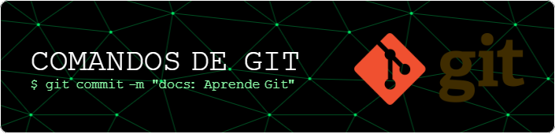
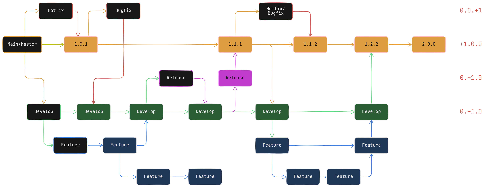

# GIT EN OPEN SOURCE

Este repositorio es un compendio invaluable de herramientas y conocimientos prácticos sobre Git. Contiene una variedad de scripts y ejemplos que demuestran cómo aplicar las mejores prácticas en el control de versiones, desde la gestión de ramas hasta la resolución de conflictos. Es un recurso esencial para aquellos que buscan mejorar su productividad y colaborar de manera eficiente en proyectos de desarrollo.

Este repositorio es tu compañero de trabajo rápido y confiable. Aquí encontrarás una colección de códigos, extraídos de fuentes oficiales y verificadas, diseñados para que puedas aplicarlos directamente a tus proyectos. Olvídate de largas explicaciones teóricas: nos centramos en mostrarte cómo utilizar cada código de forma efectiva en tu día a día.

[Documentación y Sitios Webs Oficiales](#links-para-más-información-de-git)

## Tabla de contenido

- [Todo Sobre Git](#todo-sobre-git)
  - [Tabla de contenido](#tabla-de-contenido)
  - [Conceptos Básicos en Git:](#conceptos-básicos-en-git)
      - [Directorio](#directorio)
      - [Staging Area](#staging-area)
      - [Repositorio](#repositorio)
      - [Flujo de Git](#flujo-de-git)
  - [Comandos Básicos:](#comandos-básicos)
    - [Moverse entre carpetas](#moverse-entre-carpetas)
    - [Interacciones en consola](#interacciones-en-consola)
  - [Instalar Git](#instalar-git)
  - [Configuraciones Personales del Entorno:](#configuraciones-personales-del-entorno)
    - [Configuraciones iniciales](#configuraciones-iniciales)
    - [Configurar el editor de código y consola](#configurar-el-editor-de-código-y-consola)
  - [Comenzar con comandos de Git](#comenzar-con-comandos-de-git)
    - [Inicializar Git:](#inicializar-git)
    - [Proceso de trabajo:](#proceso-de-trabajo)
    - [Subir al staging area:](#subir-al-staging-area)
    - [Ver la el contenido de la bandeja (staging area) y el area de trabajo (working directory):](#ver-la-el-contenido-de-la-bandeja-staging-area-y-el-area-de-trabajo-working-directory)
    - [Remover cambios del staging area:](#remover-cambios-del-staging-area)
    - [Enviar cambios del staging area al commit:](#enviar-cambios-del-staging-area-al-commit)
    - [Volver a un commit:](#volver-a-un-commit)
    - [Re-describir un commit:](#re-describir-un-commit)
    - [Subir archivos a un commit ya realizado:](#subir-archivos-a-un-commit-ya-realizado)
    - [Historial de commits:](#historial-de-commits)
    - [Historial de cambios en un archivo](#historial-de-cambios-en-un-archivo)
    - [Diferencias entre el Working area y el ultimo Commit:](#diferencias-entre-el-working-area-y-el-ultimo-commit)
    - [Diferencias entre Commits](#diferencias-entre-commits)
    - [Deshacer commits](#deshacer-commits)
    - [Branches en Git](#branches-en-git)
    - [Ver las branches](#ver-las-branches)
    - [Crear una nueva branch:](#crear-una-nueva-branch)
    - [Cambiar de branch:](#cambiar-de-branch)
    - [Eliminar branch:](#eliminar-branch)
    - [Renombrar branches:](#renombrar-branches)
    - [Fusionar branches:](#fusionar-branches)
    - [Problemas entre ramas:](#problemas-entre-ramas)
    - [Historial de commits 2:](#historial-de-commits-2)
    - [Snippets en Git:](#snippets-en-git)
    - [Recuperar archivos y commits borrados:](#recuperar-archivos-y-commits-borrados)
    - [Conseguir el historial de commits](#conseguir-el-historial-de-commits)
  - [Git Remote](#git-remote)
    - [Clonar un repositorio:](#clonar-un-repositorio)
      - [URL por defecto para repositorio remoto:](#url-por-defecto-para-repositorio-remoto)
    - [Subir el repositorio local al repositorio remoto:](#subir-el-repositorio-local-al-repositorio-remoto)
      - [🎁 AVANZADO -f:](#-avanzado--f)
    - [Bajar los cambios del repositorio remoto **(recomendado)**:](#bajar-los-cambios-del-repositorio-remoto-recomendado)
    - [Bajar los cambios del repositorio remoto **(cuidado)**:](#bajar-los-cambios-del-repositorio-remoto-cuidado)
    - [¿Como saber si estoy conectado a un repositorio remoto?](#como-saber-si-estoy-conectado-a-un-repositorio-remoto)
    - [Crear ramas remotas:](#crear-ramas-remotas)
  - [Conceptos básicos en GitHub:](#conceptos-básicos-en-github)
  - [Buenas practicas de Git:](#buenas-practicas-de-git)
  - [Códigos Intermedio-Avanzado de Git:](#códigos-intermedio-avanzado-de-git)
    - [Stash area:](#stash-area)
    - [cherry-pick:](#cherry-pick)
    - [tags:](#tags)
      - [¿Por qué utilizar Git tags?](#por-qué-utilizar-git-tags)
      - [Comandos básicos de Git tags](#comandos-básicos-de-git-tags)
        - [Crear un tag](#crear-un-tag)
      - [Crear un tag anotado (recomendado)](#crear-un-tag-anotado-recomendado)
      - [Ver la lista de todos los tags](#ver-la-lista-de-todos-los-tags)
      - [Ver información de un tag](#ver-información-de-un-tag)
      - [Eliminar un tag local](#eliminar-un-tag-local)
      - [Buenas prácticas con Git tags](#buenas-prácticas-con-git-tags)
      - [Ejemplo práctico](#ejemplo-práctico)
    - [rebase y squash:](#rebase-y-squash)
    - [bisect:](#bisect)
      - [¿Como utilizar git bisect?](#como-utilizar-git-bisect)
  - [Estrategias de branching:](#estrategias-de-branching)
    - [Git Flow:](#git-flow)
      - [Introducción](#introducción)
      - [Descripción general de la estrategia de Git Flow](#descripción-general-de-la-estrategia-de-git-flow)
      - [Herramientas e integraciones de flujo de trabajo](#herramientas-e-integraciones-de-flujo-de-trabajo)
      - [Desafíos comunes](#desafíos-comunes)
      - [¿Cómo utilizar GitFlow?](#cómo-utilizar-gitflow)
        - [Inicializar GitFlow:](#inicializar-gitflow)
        - [Crear ramas:](#crear-ramas)
        - [Merge de una rama:](#merge-de-una-rama)
  - [Conventional Commits](#conventional-commits)
    - [Resumen](#resumen)
    - [El commit contiene los siguientes elementos estructurales, para comunicar la intención a los consumidores de tu librería:](#el-commit-contiene-los-siguientes-elementos-estructurales-para-comunicar-la-intención-a-los-consumidores-de-tu-librería)
      - [Ejemplos](#ejemplos)
    - [Especificación](#especificación)
  - [Enlaces, para más información de Git:](#enlaces-para-más-información-de-git)
  - [Aviso sobre enlaces](#aviso-sobre-enlaces)

## Conceptos Básicos en Git:

#### Directorio

El área de trabajo (working directory) es efectivamente la carpeta donde se encuentran los archivos con los que estás trabajando actualmente en un proyecto bajo control de versiones. Es como tu escritorio personal, pero con la ventaja de estar conectado a un sistema que registra todos los cambios que realizas.

#### Staging Area

El staging area no es donde modificamos los archivos, sino donde preparamos los cambios para ser guardados en el repositorio.

#### Repositorio

Un repositorio es un sistema de control de versiones que almacena de manera organizada y eficiente todos los archivos de un proyecto, junto con el historial completo de cambios realizados en ellos.

#### Flujo de Git

**Proceso explicado con una tienda de batidos:**

1. Área de trabajo (working directory): Es la barra donde preparas los batidos. Aquí es donde mezclas los ingredientes, añades hielo y decoras los vasos etc.

2. Bandeja (staging area): Una vez que tienes un vaso listo, lo colocas en la bandeja. La bandeja es como un lugar de espera temporal antes de llevar los vasos a la mesa.

3. Mesa (repositorio): La mesa representa el lugar final donde se sirven las bebidas a los clientes. Al llevar la bandeja a la mesa y dejar los vasos, estás guardando un registro permanente de las bebidas que se han servido.

> Aun tenemos que saber más cosas, pero podemos comenzar con esto.

## Comandos Básicos:

Antes de comenzar a utilizar Git te recomiendo aprender unos comandos básicos que nos facilitan la vida.

### Moverse entre carpetas

`cd [para mover hacia adelante]`

`cd ../ [para mover hacia atrás]`

`cd .. [para mover hacia atrás]`

### Interacciones en consola

**Ver los archivos de carpeta actual:**

`$ ls`

**Ver los archivos ocultos**

`$ ls -a` es importante cuando deseamos modificar algún archivo privado de los lenguajes o del mismo Git.

**Ver la dirección donde estamos posicionados:**

`$ pwd` también se puede visualizar desde la misma consola.

**Crear una carpeta**

`$ mkdir nombre_de_la_carpeta`

**Eliminar una carpeta**

`$ rmdir nombre_de_carpeta`

**Crear un archivo**

`$ touch archivo.txt`

**Eliminar una carpeta**

`$ rm nombre_archivo`

**Cambiar el nombre de un archivo**

`$ git mv archivo_a_renombrar archivo_renombrado`

**Limpiar la consola con**

`$ clear`

**Abrir VS-Code**

`$ code .`

Con este comando logramos abrir visual studio code en el directorio que nos encontremos posicionados. Por ejemplo, si estamos en `C:/Users/User/Desktop/Git/` y desde el `Git Bash` o el `Power Sell` iniciaremos en la carpeta Git

## Instalar Git

Instalar git en la pagina oficial [git-scm.com](https://git-scm.com/downloads).

**Verificar la instalación con:**

`$ git --version` o `$ git -v` (es el resumen)

## Configuraciones Personales del Entorno:

**Alcance de las configuraciones:**

Todas las configuraciones pueden ser realizadas de distintas formas, para que su alcance sea diferente, ya queda en su gusto determinar con cuales configuraciones quiere trabajar.

-   Sistema: Todos los usuarios y repositorios contenidos en el ordenador.
-   Global: Solo el usuario desde el que se registra git.
-   Local: Solo los repositorios en el que se inicia git.

---

### Configuraciones iniciales

**Nombre de usuario:**

-   `$ git config --system user.name "Nombre"`
-   `$ git config --global user.name "Nombre"`
-   `$ git config --local user.name "Nombre"`

**Correo electrónico del usuario:**

-   `$ git config --system user.email "xxxxxx@gmail.com"`
-   `$ git config --global user.email "xxxxxx@gmail.com"`
-   `$ git config --local user.email "xxxxxx@gmail.com"`

---

### Configurar el editor de código y consola

**Dar color a la interface (consola)**

`$ git config --global color.ui true`

**Activa tu editor de código por defecto:**
(en este caso es VSCODE)

`$ git config --global core.editor "code --wait"`

Lo que significa --wait, es para que cuando modifiquemos algo en visual studio code, se envié y confirme al cerrar visual studio code.

**Activar el CRLF en consola:**

`$ git config --global core.autocrlf true`

Con esto vas a evitar que siga escribiendo en la consola en usa sola linea indefinidamente. Cuando actives esta configuración, el texto se ajustara a tu pantalla automáticamente.

**Para ver todas las configuraciones que realizamos en Git:**

`$ git config --list`

## Comenzar con comandos de Git

Antes de inicializar Git en tu proyecto, primero debes estar posicionado en la dirección del mismo. Para lograr esto puedes acceder a tu carpeta, dal clic derecho y seleccionar `Open Git Bash` o entrar en la consola y dirigirte a la carpeta con los comandos explicados anteriormente, ejemplo:

    $ cd users/user-name/desktop/example-project <GIT BASH>
    > cd users/user-name/desktop/example-project <CMD>

Luego de estar en la carpeta donde vamos a utilizar git, escribir el comando de iniciar de Git.

> **Ayuda en git:** todos los códigos que vamos a explicar vienen acompañados con otros códigos, si queremos investigar cuales son todos los que podemos utilizar; debemos escribir luego del código principal `-help`

### Inicializar Git:

`$ git init`

Luego de iniciar git, veremos que en la consola nos aparece lo siguiente `users/user-name/desktop/example-project (master_or_main)` quiere decir que la instalación ha sido exitosa.

Para comenzar a utilizar Git debemos saber, el proceso que debemos pasar para utilizar Git. Siguiendo con el ejemplo de los batidos:

> Supongamos que queremos prepara un batido, para la mesa numero 1, en la mesa numero 1 hay 5 personas y cada una quiere un batido diferente.
>
> Fresa, Patilla, Naranja, Limón y Mango

Cada batido contiene sus ingredientes correspondientes; por ejemplo el de fresa debe de llevar más azúcar que el de patilla y así con los demás.

Cuando estamos programando sucede exactamente lo mismo y Git nos ayuda a llevar las ordenes y las recetas de preparación.

### Proceso de trabajo:

    1. Para preparar el primer batido, no utilizamos Git (working directory).
    2. Una vez listo el primer batido, debemos subirlo a la bandeja (staging area).
    3. Al terminar todos los batidos de uno en uno debemos enviarlo a la mesa (repositorio).
    4. Atender a las demás mesas y repetir el proceso.

Este es el proceso que deberíamos replicar con nuestro flujo de trabajo en Git.

### Subir al staging area:

`$ git add nombre_del_archivo`

Si en vez de `nombre_del_archivo` colocamos `.` se suben todos los archivos.

### Ver la el contenido de la bandeja (staging area) y el area de trabajo (working directory):

El código `$ git status` nos permite visualizar como se encuentra el código, por ejemplo, si eliminamos un archivo, esto nos dirá cual es el archivo que eliminamos, si agregamos un archivo nos dirá cual agregamos y así sucesivamente.

Si queremos hacer mas cortos los mensajes de `$ git status`, podemos utilizar `$ git status -s` -s de -short.

> Ya que has entendido el contexto, pongámonos técnicos.

### Remover cambios del staging area:

`$ git rm --cached nombre_de_archivo_a_remover`

`rm` de remove

Ahora tenemos un nuevo concepto y es commit, ya sabes lo que es un commit, el commit es el proceso de llevar la bandeja a la mesa numero 1.

A este proceso se le llama commit.

### Enviar cambios del staging area al commit:

El commit enviara todo lo que tengamos en el staging area, por esto es importante mantener en el staging area solo "los batidos" terminados.

Con `$ git commit` nos abrirá en nuestro editor de código una ventana, solicitando un mensaje clave, para identificar los cambios que están haciendo, en el caso del ejemplo **"Batido de Fresa"**.

Con `$ git commit -m "Batido de Fresa"` podemos agregar el comentario desde la consola.

`$ git commit -m "Batido de Fresa" -a`

`-a` lo utilizamos si no hemos subido los archivos al staging area, con `-a` lo que hacemos es hacer un `git add .` y luego `git commit -m "Batido de Fresa"`

### Volver a un commit:

> Elimina los cambios realizados en el working area.

`$ git restore código_commit`

Aquí introducimos el termino "volver a un commit", los commits no son solo el proceso de servir los batidos, sino que cuando hacemos un commits, damos una breve descripción de lo que hicimos "Batido de Fresa" esta descripción queda registrada junto con un código único de identificación.

    Ejemplo: "Batido de Fresa" [01asd125fa2sd5df]

Este código lo podemos obtener al revisar el historial de commits.

### Re-describir un commit:

Con `$ git commit --amend` podemos re-describir el ultimo commit realizado, si utilizamos este código, nos abrirá una nueva ventana donde nos permitirá editar el contenido escrito del commit. El commit será modificado cuando cerremos la ventana de modificación.

### Subir archivos a un commit ya realizado:

> Hay ocasiones en las que luego de hacer un commit, notamos que debimos subir un cambio realizado o debimos modificar una pequeña cosa antes de subirlo. Lo ideal seria hacer un nuevo commit, pero es poco practico realizar un nuevo commit si a nuestro código solo le faltaba un `);` por ejemplo.
>
> En ese caso utilizamos el siguiente código.

1. Realizar los cambios que necesitamos.
2. Subir los cambios del working area al staging area.
3. Realizar un re-describir commit, explicado en el apartado anterior.
4. Re-describir el commit o dejarlo igual.

    $ git add ejemplo.txt
    $ git commit --amend

### Historial de commits:

Con `$ git log` podemos ver el historial de commits completo de nuestro proyecto.

    Ejemplo de un commit del repositorio:

    commit 094008b338a43d1e4fe18432c984f6f3053b5851 //código_commit
    Author: Nombre-Del-Autor <email>
    Date:   Tue Oct 15 18:36:40 2024 +0300

    fix: :bug: corrección ortográfica del código

Esta estructura cuando nuestro proyecto contiene miles de commits, puede resultar ineficiente, para ello podemos mejorar esto al agregar `--oneline` significa en una linea y nos facilita extraer los códigos resumidos de los commits.

`$ git log --oneline`

    09400 fix: :bug: corrección ortográfica del código

Como podemos ver, trae menos información, y resume el código commit, cuando trabajemos con branches, veremos un nuevo código de este mismo tema.

> Cuando existen miles de commits en nuestro historial puede existir una minima posibilidad de que ocurran errores entre los códigos commits, ya que se pueden repetir los primero 5 dígitos, en ese caso se recomienda aumentar los dígitos del código a 7 dígitos.

Esto lo hacemos con el comando `$ git config --global core.abbrev "cantidad_dígitos"` si recordamos el apartado de [configuraciones](#configuraciones-iniciales) el código `--global` hace que guardemos esta configuración de forma global, lo puedes configurar a tu gusto.

    Ejemplo:

    $ git log --oneline
    c8603 (HEAD -> feature/xxxx) docs: 📝 modificación de código hasta historial de cambios

    $ git config --local core.abbrev 7

    $ git log --oneline
    c860368 (HEAD -> feature/xxxx) docs: 📝 modificación de código hasta historial de cambios

    // El código no cambio, solo agrego dos dígitos más al código.

### Historial de cambios en un archivo

Cada archivo, contiene una serie de cambios, estos cambios pueden ser, la edición de un archivo, crear una carpeta, modificar un texto, cualquier cosa que hagamos en el repositorio es visto como un cambio, si queremos ver los cambios realizados en un archivo en particular antes de realizar un commit, podemos verlo con:

`$ git show nombre_de_archivo`

    Ejemplo:

    $ git show README.md

    commit dad240691c74ca73726fba912201b5a45f9286af (master)
    Merge: 8211b 7842d
    Author: xxxxx xxxxx@xxxx.com
    Date:   Tue Oct 15 18:41:24 2024 +0300

    Merge tag 'corrección-ortográfica-gramática' into develop

    0.1.1.1

    diff --cc README.md
    index 374e3,b1471..a0eeb
    --- a/README.md
    +++ b/README.md
    @@@ -1,26 -1,26 +1,30 @@@
    - # Códigos de Git
    -# Códigos de Git
    ++# Todo sobre Git

    ...

> Estos son ejemplos reales del repositorio en el que se encuentra leyendo esto.

Si deseamos ver los archivos que fueron modificados por un commit en especifico utilizamos el código `$ git ls-tree -r --name-only código_commit`.

### Diferencias entre el Working area y el ultimo Commit:

Con `$ git diff --staged` podemos observar todos los cambios que hemos realizado nosotros o nuestro equipo y compararlo con el ultimo commit realizado, para que esto lo podamos observar, los cambios deben estar en el staging area.

### Diferencias entre Commits

`$ git diff "código_commit_1" "código_commit_2"`

Si no queremos ver los cambios y las modificaciones linea por linea, también podemos observar los archivos cambiados, agregando `--name-only` y para ver las lineas modificadas con el código `--word-diff`.

    `$ git diff --name-only "código_commit_1" "código_commit_2"`
    `$ git diff --word-diff "código_commit_1" "código_commit_2"`

### Deshacer commits

Para deshacer commits, tenemos varias formas de hacerlo, cada una es util para situaciones diferentes.

La estructura del código es `$ git reset --xxx código_commit` si sustituimos las (xxx) con alguno de estos comandos podremos deshacer los commits de formas diferentes, una más invasiva que la otra:

> El código_commit debe ser del commit al que queremos volver, no del commit que queremos eliminar, si utilizamos el commit anterior al actual, eliminaremos el commit actual, si son dos volveremos dos y asi sucesivamente.

-   `--soft` elimina el commit y los cambios contenidos en el commit eliminado, los envía al staging area, no modifica el working area, ni elimina los cambios realizados fuera del commit.
    -   Se recomienda utilizar (soft) siempre que queramos bajar los cambios del commit, para modificarlos, mejorarlos o recuperar información que hemos cambiado (también se puede realizar con diff).
-   `--mixed` elimina el commit y los cambios contenidos en el commit, no se modifica el staging area ni el working area.
    -   Si solo queremos eliminar el commit y sus cambios es recomendado utilizar (mixed) sin embargo se corre con el riesgo de perder un cambio importante.
-   `--hard` elimina el commit, los cambios contenidos en el commit, el staging area y las modificaciones nuevas del working area.
    -   Se suele utilizar cuando deseamos deshacer todos los cambios que hemos realizado, deseamos tener la copia exacta del commit al que estamos volviendo. Ya que con esto perderemos todos los cambios realizados y tendremos una copia exacta del commit al que se vuelve.

> ⚠️**Alerta:** Si aun no comprende que función hace cada uno de estos comandos, investigar la documentación oficial de Git sobre `$ git reset --xxx` ya que puede llevar a perdidas importantes en su proyecto.
>
> Si aun así desea utilizar estos comandos, puede comenzar utilizando --soft, para ir entendiendo como funciona.

    Ejemplo: He realizado unos cambios y para explicar un comando, me vi obligado a realizar un commit de mis cambios, por ello realize el commit que ya observaste en el historial de cambios código_commit (c860368), como este commit no estaba previsto, voy a bajar los cambios de este commit al staging area, para luego hacer solo un commit con todos los cambios de redacción.

    $ git reset --soft dad2406

    El commit fue eliminado con éxito y no he perdido ninguno de los cambios realizados hasta ahora.

> Hasta este punto ya tus conocimientos de Git son suficientes para manejar tus proyectos propios eficazmente, ahora aprenderás como ser **eficiente** al trabajar en Git con tus proyectos y los de otros.
>
> Vamos a introducir nuevos conceptos, aumentamos la complejidad y cada vez iremos siendo más formales para que te introduzcas a la jerga en Git.

### Branches en Git

Las **branches** (ramas) son una herramienta fundamental para gestionar de manera eficiente el desarrollo de un proyecto.

Imagina que tienes un árbol: el tronco principal representa la línea de desarrollo principal de tu proyecto, y las ramas son bifurcaciones que se extienden desde ese tronco.

**Para que utilizar branches:**

-   **Desarrollo paralelo:** Puedes crear ramas diferentes para trabajar en distintas funcionalidades o corregir errores de forma independiente, sin afectar el código principal. Esto es especialmente útil cuando varios desarrolladores trabajan simultáneamente en un mismo proyecto.
-   **Experimentación:** Puedes crear ramas para probar nuevas ideas o características sin riesgo de romper el código principal. Si algo no funciona, simplemente eliminas esa rama y vuelves a la rama principal.
-   **Versionado:** Cada rama representa una versión específica del código. Esto te permite volver a una versión anterior si es necesario, o comparar diferentes versiones para ver los cambios realizados.
    -   Se que has visto en algún momentos algo como **AppEjemplo v2.3.5** esto es el versionado y los manejamos con branches, pero por ahora no nos compliquemos tanto.

**¿Cómo funcionan las branches?**

Sin darte cuenta has estado trabajando con una branch, desde que inicializaste Git:
En la url de tu repositorio debe aparecer algo asi: /desktop/proyecto/repositorio (master)
(master) -> es la rama por defecto que has creado al iniciar Git.

Las branches tienen muchísimas teorías recomendaciones etc, pero por los momentos esto es lo que debemos de saber.

1. **Creación:** Como ya nos encontramos en la branch (master) debemos crear otra rama, ya que al trabajar en la misma corremos el riesgo de dañar nuestro proyecto si queremos hacer una prueba de código.
2. **Cambio de rama:** Una vez que creamos la rama aun estaremos en la (master), así que nos debemos mover a la nueva.
3. **Fusión:** Si los cambios que realizamos los deseamos unir a nuestro proyecto principal podemos unir ambas ramas(branches).

**Ejemplo práctico:**

Imagina que estás desarrollando una aplicación web. Puedes crear una rama llamada "nueva-funcionalidad" para trabajar en una nueva característica. Mientras tanto, otro desarrollador puede crear una rama llamada "corregir-bug" para solucionar un error de código. Al finalizar sus tareas, ambos pueden fusionar sus ramas en la rama principal o si la nueva funcionalidad no puede ser utilizada, se podría eliminar la rama y la aplicación web no tendría problemas.

### Ver las branches

Si quieres ver todas las branches de tu proyecto, puedes hacerlo con el comando `$ git branch`.

### Crear una nueva branch:

Con `$ git branch nombre-de-la-rama` crearas una rama en tu repositorio, por convención de los programadores, se conoce como buena practica utilizar Kebab-case para nombrar las branches, como en el ejemplo anterior **"nueva-funcionalidad"**.

### Cambiar de branch:

Existen dos formas de cambiar ramas en Git, sin embargo una de estas formas es especialmente para cambiar de ramas y la otra es la más utilizada pero no fue creada para realizar esta acción directamente.

La mejor forma de cambiar de branch es con el código `$ git switch nueva-funcionalidad`, sin embargo también podemos hacer lo mismo con el código `$ git checkout nueva-funcionalidad`.

Estás dos formas hacen exactamente la misma acción.

Nosotros al escribir código solemos reducir el trabajo al mínimo posible, así que si lo que quieres es crear una nueva branch y moverte inmediatamente a ella, sin necesidad de escribir un segundo comando, lo puedes hacer con:

1. `$ git switch -c nueva-funcionalidad`
2. `$ git checkout -b nueva-funcionalidad`

### Eliminar branch:

Con este código podemos eliminar la branch que creamos anteriormente `$ git branch -d nueva-funcionalidad`; algo a tener en cuenta es que para eliminar una rama, no debemos estar posicionados en la rama que deseamos borrar, en este caso debemos hacer primero un `$ git switch master` y luego `$ git branch -d nueva-funcionalidad`

> La mejor forma de verle sentido a todo es conseguirle el significado, siempre los programas están diseñados para ser lo mas intuitivos posibles.
>
> Podemos ver el `-d` como -delete (borrar o eliminar)

### Renombrar branches:

En estos momentos yo me encuentro posicionado en una rama llamada **feature/refactor-code-description-insertimage** y este nombre me pareció conveniente cuando la cree, pero ahora me resulta horrible, es poco intuitivo y no se enfoca en una sola tarea, por utilizare el código `$ git branch -m feature/readme-description` para hacer referencia que en esta rama es donde estoy realizando toda la descripción del archivo readme.

    Antes:
    /Desktop/Programming/git/git (feature/refactor-code-description-insertimage)

    Después:
    /Desktop/Programming/git/git (feature/readme-description)

Si no hubiera estado posicionado en la rama que cambie pude haber utilizado el código `$ git branch -m nombre-antes nombre-después`

### Fusionar branches:

Al proceso de fusionar una rama con otra se llama **merge** (unir)

Si los cambios que hemos realizado los queremos fusionar con cualquier rama, debemos primero posicionarnos en la rama que con la que queremos fusionar y luego utilizar `$ git merge nombre-de-la-rama-a-fusionar` por ejemplo:

    $ git branch
    *new-function //el * nos indica donde nos encontramos posicionados
    master

    $ git switch master
    $ git branch
    new-function
    *master

    $ git merge new-function
    $ git branch
    new-function
    *master

Aunque no lo podamos apreciar, la rama "new-function" fue fusionada con la rama master, pero esta no es eliminada automáticamente, para eliminarla debemos utilizar `$ git branch -d new-function`

### Problemas entre ramas:

Cuando trabajamos con varias personas, ocurre que ambos podemos hacer varios cambios sobre el mismo repositorio y si ambos estamos trabajando con diferentes branches, sus branches tienen una cierta cantidad de cambios y los nuestros tienen otros, en ese momento ocurre algo simple de solucionar llamados **merge conflicts**.

### Historial de commits 2:

Recuerda que te comente que volveríamos al apartado de [historial de commits](#historial-de-commits), en este caso veremos el historial de commits en branches.

Si deseamos ver el historial de commit de la rama en la que estamos utilizamos el código `$ git log --oneline`, pero si queremos ver el historial de commits de todas las ramas utilizamos `$ git log --oneline --all`, pero esto es difícil de ver, porque se nos complicaría saber cual commit es de que rama, asi que podemos graficarlos en la consola con `--graph`.

    $ git log --oneline
    dad2406 (HEAD -> feature/readme-description) Merge tag 'corrección-ortográfica-gramática' into develop
    7842da8 (tag: corrección-ortográfica-gramática, master) 0.1.1.1
    094008b fix: :bug: corrección ortográfica del código
    7a3a677 refactor: :recycle: cambio de nombre de la imagen de flujo git png

    $ git log --oneline --all
    dad2406 (HEAD -> feature/readme-description, origin/feature/refactor-code-description-insertimage) Merge tag 'corrección-ortográfica-gramática' into develop
    01b1175 (develop) Merge tag 'corrección-ortográfica-gramática' into develop
    7842da8 (tag: corrección-ortográfica-gramática, master) 0.1.1.1
    094008b fix: :bug: corrección ortográfica del código
    7a3a677 refactor: :recycle: cambio de nombre de la imagen de flujo git png
    8211b4f (origin/develop, feature/git-hooks) 0.1.1

    $ git log --oneline --all --graph
    dad2406 (HEAD -> feature/readme-description, origin/feature/refactor-code-description-insertimage) Merge tag 'corrección-ortográfica-gramática' into develop
    |\
    | | _ 01b1175 (develop) Merge tag 'corrección-ortográfica-gramática' into develop
    | |/|
    |/|/
    | _ 7842da8 (tag: corrección-ortográfica-gramática, master) 0.1.1.1
    | |\
    | | _ 094008b fix: :bug: corrección ortográfica del código
    | | _ 7a3a677 refactor: :recycle: cambio de nombre de la imagen de flujo git png

> Este repositorio no esta creado para aceptar colaboraciones de otros programadores, en caso de trabajar en proyectos abiertos, debemos adaptar nuestros commits, a como lo exigen los creadores del proyectos, por ejemplo:
> Escribir el commit en ingles, utilizar buenas practicas a la hora de crear commits.

### Snippets en Git:

Hay códigos de git, que son sumamente largos y en ocasiones debemos ejecutar este código una y otra vez, para no perder demasiado tiempo escribiendo lo mismo una y otra vez, podemos guardar este código en una función que ejecute ese código de forma resumida.

Para hacerlo debemos configurar nuestro Git con `$ git config --local alias.nombre-de-resumen "código que deseamos resumir sin la preposición git al inicio"`

**Por ejemplo:**

Deseo ver el `$ git log` de la siguiente forma: \* código_commit comentario_commit fecha_creación autor_commit

    Para eso ejecuto el código:

    $ git log --oneline --all --graph --decorate --pretty=format:'%h %s %ad %an'
    *   dad2406 Merge tag 'corrección-ortográfica-gramática' into develop Tue Oct 15 18:41:24 2024 +0300 Jackziel-Sumoza
    |\
    | | * 01b1175 Merge tag 'corrección-ortográfica-gramática' into develop Tue Oct 15 18:41:24 2024 +0300 Jackziel-Sumoza

Este código es sumamente largo y confuso, para resolver esto podemos crear un resumen o snippet de este commit, lo llamare **hard-git-log**.

    $ git config --local alias.hard-git-log "log --oneline --all --graph --decorate --pretty=format:'%h %s %ad %an'"

    // Comprobamos:
    $ git config --list
    alias.hard-git-log=log --oneline --all --graph --decorate --pretty=format:'%h %s %ad %an'

    // Ejecutamos:
    $ git hard-git-log
    * dad2406 Merge tag 'corrección-ortográfica-gramática' into develop Tue Oct 15 18:41:24 2024 +0300 Jackziel-Sumoza
    |\
    | | * 01b1175 Merge tag 'corrección-ortográfica-gramática' into develop Tue Oct 15 18:41:24 2024 +0300 Jackziel-Sumoza

Lo que hicimos fue guardar un alias local para resumir el código y ejecutarlo más rápido, esto lo podremos ver en `git config --list`.

> ☑️ **Importante:** si en la consola tienes algo como `(END)` y no sabes como salir de ese modo, solo utiliza la tecla [Q] o [Esc].

### Recuperar archivos y commits borrados:

Imagina que estas trabando en un proyecto y notas que hay un código obsoleto que no utilizas desde el 1910 y tu porque sabes de programación sabes que ese código al cargarse y no hacer nada, aumenta el tiempo de carga de tu sitio web y por eso decides eliminarlo de por vida, pierdes el archivo, pierdes el código.

Luego ves que algo dejo de funcionar en tu sitio web, sabes que lo único que has hecho es eliminar el archivo, pero ya no lo tienes a tu disposición, en este caso puedes hacer dos cosas:

1. Recuperar el archivo y subirlo en un nuevo commit.
2. Volver al commit en el que se encontraba el archivo.

Par la opción uno utilizamos el `$ git restore nombre_de_archivo_borrado` y para la opción dos utilizamos el código `$ git reset --hard código_commit`.

Ahora, no se si recuerdas que en secciones anteriores, elimine un commit, ese commit fue eliminado completamente, si en el ejemplo que te comente, resulta que ese archivo fue subido en ese commit que yo elimine por completo y el archivo también fue eliminado por completo, ahora que hacemos "posiblemente nos despidan 😅" pero si sabemos que Git, guarda un historial completo con todos los commits que hemos realizado desde que inicializamos Git, podremos salvarlo.

En estos momentos yo no puedo encontrar el código_commit porque lo elimine por completo.

### Conseguir el historial de commits

Con `$ git reflog` podemos ver el historial de todos los commits y los movimientos del HEAD (explicare más adelante); aquí podremos encontrar ese commit, para recuperarlo y traerlo de nuevo con el comando anteriormente mencionado (tener cuidado, recuerda que con `reset --hard`, podemos perder los cambios actuales y los demás, recuperarlo en una rama secundaria y con las medidas necesarias para no correr más riesgos).

    $ git reflog
    c860368 HEAD@{7}: commit (amend): docs: 📝 modificación de código hasta historial de cambios
    353f7fd HEAD@{8}: commit: docs: :memo modificación de código hasta historial de cambios; solo archivo readme.md

Al buscar pude conseguir el commit que eliminamos anteriormente y podemos ver que no es solo un código_commit, sino que son dos, porque luego de realizarlo, cree un `commit --amend` para subir el código con nuevos cambios, explicado en la sección de commits.

Si de verdad deseara recuperar ese commit, yo utilizaría el commit (amend) [c860368]

## Git Remote

Nuestros repositorios están en nuestro PC pero para trabajar con más personas necesitamos, tener un repositorio en la nube, que se mantenga constantemente actualizado, nos permita conectarnos a el desde cualquier lugar y además poder tener una gestión de commits, para evitar que los equipos de desarrollo generen conflictos.

En este caso yo para efectos prácticos utilizaré GitHub, que es uno de los repositorios remotos más utilizados. No enseñare a utilizar GitHub, solo algunos conceptos indispensable para trabajar con repositorios remotos.

### Clonar un repositorio:

Hay dos formas de utilizar un repositorio remoto, una es nosotros exportar nuestro repositorio local a un repositorio remoto y el segundo es clonar un repositorio existente en la nube.

1. **Subir un repositorio directamente del local:**
    1. Crear un repositorio en GitHub y luego copiar la url de este repositorio y agregarlo [Agrega un Repositorio por defecto](#url-por-defecto-para-repositorio-remoto).
    2. Hacer un **push** con el repositorio local [¿Como hacer un push?](#subir-el-repositorio-local-al-repositorio-remoto)
2. **Clonar un repositorio:** Primero nos ubicamos desde el GIT BASH en el directorio en el que queremos clonar, luego ejecutamos el código `$ git clone https://github.com/Jackziel-Sumoza/Git.git` este es el repositorio remoto de esta guía de Git. Cuando hacemos `$ git clone` automáticamente la URL queda registrada como por defecto en los demás comandos (`origin = URL`), la palabra `origin` hace referencia al repositorio en la nube.

Si no clonamos el repositorio debemos ejecutar un código para agregar una URL por defecto.

#### URL por defecto para repositorio remoto:

Para configurar una url que es la url de nuestro repositorio remoto, podemos hacerlo con el siguiente código `git remote add origin https://remote-repo-url`.

### Subir el repositorio local al repositorio remoto:

Una vez que tenemos los repositorios enlazados, debemos hacer nuestro primero `push`, un push es literalmente empujar nuestros cambios locales, a el repositorio remoto, antes de hacer el push, debemos revisar que no tengamos conflictos (explicado en la sección siguiente).

Con el código `$ git push origin master` le decimos a Git que queremos subir los cambios a "origin" (repositorio remoto) y lo queremos subir a la rama master (rama principal).

#### 🎁 AVANZADO -f:

Cuando realize anteriormente un `reset --hard` elimine código que ya estaba en el repositorio remoto, por ello al momento de querer subir los cambios al repositorio remoto me solicitaba, que bajara los cambios que yo había eliminado para poder subir los nuevos cambios, pero esto generaba un conflicto, porque yo justamente quería eliminar esos commits.

Por ello tuve que ejecutar el siguiente código `$ git push -f origin master`.

`-f` lo que hace es forzar un push, alterando completamente el historial del repositorio remoto, utilizar este comando con cuidado, en la mayoría de las ocasiones es mejor solucionar los conflictos.

### Bajar los cambios del repositorio remoto **(recomendado)**:

Cuando otros compañeros han trabajado sobre el mismo repositorio, hace que nuestro repositorio local quede desactualizado, para solucionar esto, lo que podemos hacer es bajar los cambios para mantener nuestro repositorio local actualizado. Esto conlleva algunos inconvenientes, entre ellos los conflictos.

Con `$ git fetch` bajamos las actualizaciones del repositorio remoto y estas actualizaciones quedan en nuestro repositorio local en el staging area, nosotros podremos revisar los cambios, ver que sucedió, quien hizo los cambios etc.

### Bajar los cambios del repositorio remoto **(cuidado)**:

Existe otra forma más agresiva de actualización y es `$ git pull` con git pull actualizamos nuestro repositorio local, pero los cambios no se quedan en el staging area, sino que se vinculan automáticamente con nuestro repo local.

### ¿Como saber si estoy conectado a un repositorio remoto?

Con `$ git remote -v` te aparecerá la url en la que estás conectado y te aparecerán dos, una para el pull y la otra para el fetch, en ambos casos será la misma.

    $ git remote -v
    origin  https://github.com/Jackziel-Sumoza/Git.git (fetch)
    origin  https://github.com/Jackziel-Sumoza/Git.git (push)

### Crear ramas remotas:

En los repositorios remotos también podemos crear ramas, y para crear una rama remota podemos hacerlo de varias maneras, la primera es:

-   Crear la rama en local `$ git branch nombre-rama`
-   Subir la rama con `$ git push origin nombre-rama`

Si queremos que de ahora en adelante los pull y los fetch los hagamos de esta rama nueva debemos agregar el `-u`, `$ git push -u origin nombre-rama`

## Conceptos básicos en GitHub:

**fork:** Es hacer una copia de el repositorio de otra persona en mi repositorio de Github, lo utilizamos cuando un proyecto ya esta creado y queremos bajarlo a nuestro repositorio local.

**issue:** Es una lista de tareas de un proyecto completo, tareas para mejorar el código, crear documentación (es exactamente una lista de tareas por hacer).

**Milestone:** Son un conjunto de issues agrupados.

## Buenas practicas de Git:

**Una rama, un objetivo:** Cuando creamos ramas debemos hacerlas pensando que en ella vamos a solucionar un solo problema, una buena forma de verlo es crear una rama si queremos solucionar un issue y utilizar ese issue resumido como titulo de la rama.

**Nombre de la rama:** La rama debe ser descriptiva escrita con kebab-case (separado por **-**).

**NUNCA:** Nunca debemos trabajar en la rama principal.

**Commits significativos:** Los commits deben de ser significativos, en este repositorio yo no estoy manteniendo buenas practicas de commits, sin embargo cuando trabajamos en proyectos más serios debemos de realizar commits completos.

No debemos realizar commits sin significado, piensa en lo siguiente, los commits deben de ser lo suficientemente pequeños como para tener un historial con el paso a paso del proyecto, pero lo suficientemente significativos como para no ser innecesarios o redundantes.

**Commits descriptivos:** Los commits deben de entenderse solo con leerlos, al leer un commit yo debería de saber que sucedió en el.

**Los tags:** Los tags no los hemos explicado, pero estos deben de ser muy relevantes, usualmente se utilizan tags, solo de las versiones lanzadas a producción para hacer referencia a ellas más adelante.

[leer git tags](#tags)

**Mantener el historial limpio:** Esto es sumamente complicado en los proyectos medianos y grandes ya que el orden se va perdiendo mientras se trabaja con muchos integrantes, para ello se utilizan diferentes estrategias de commits que nos ayudan a mejorar el historial, las mejores estrategias ocurren también en los merges.

## Códigos Intermedio-Avanzado de Git:

### Stash area:

Si tenemos cambios que necesitamos guardar para cambiarnos a una rama que necesitamos trabajar, lo solucionamos con stash (stash es un lugar temporal en el que guardamos los cambios pero estos no son directamente formalmente terminados) stash es un borrador dentro de git.

Si no sabes cuando utilizarlo es simple:

-   Estas trabajando en crear un menu desplegable, cuando el project manager te comenta que necesita inmediatamente una solución para un problema en producción. Ya que una cosa no tiene que ver con la otra, necesitas crear otra rama, hacer nuevos cambios, nuevos commits ...
-   Lo ideal es antes de cambiarte de rama, enviar los cambios a un borrador.

Con `$ git stash` se guardan los cambios en la zona de borrador.

`$ git stash list` nos muestran los archivos guardados en el stash area

`$ git stash show` nos muestra el archivo preciso en el que se modifico el código contenido en el stash area.

`$ git stash show -p` nos muestra las lineas que fueron modificadas por el código contenido en el stash area.

`$ git stash apply` devuelve todos los cambios contenidos en el stash area de la rama en la que estamos posicionados. Si solo queremos devolver un cambio puntual del stash, debemos agregar luego del `apply` el indice del cambio.

Cuando guardamos cambios al stash, recomiendo agregar un comentario para identificar los cambios que este contiene, y esto lo hacemos con el código `$ git stash push -m "comentario del stash"`

`$ git stash pop` borra el primer código contenido en el stash, si queremos borrar uno puntual, agregamos el indice. Otra forma de hacerlo es con `$ git stash drop indice-del-cambio`.

### cherry-pick:

Un cherry pick es un proceso de traer los cambios de un commit a un merge, lo que sucede es que no hacemos un merge completo y el commit que hicimos se duplica ya que no elimina el de la rama secundaria, lo que sucede en ese caso es que tendremos dos commits idénticos, si luego hacemos un merge completo de la rama nos traerá un error ya que nos dice que no puede existir dos commits con el mismo código_commit.

`$ git cherry-pick código_de_commit ...`

Otra forma de crear un cherry-pick es con rebase, con esto logramos tener una ventana interactiva que nos permite elegir de multiples commits, cual queremos utilizar, y cuales no, reordenarlos etc, es mas simple si no queremos trabajar tan profundamente con los hashes.

`$ git rebase -i HEAD~Indice` puede ser con el indice o el código del commit.

### tags:

Un tag es como una etiqueta que pegas en un commit para marcarla como especial.

#### ¿Por qué utilizar Git tags?

-   **Marcar versiones:** Identificar claramente las diferentes versiones de tu software.
-   **Realizar lanzamientos:** Indicar cuándo una versión está lista para ser publicada.
-   **Hacer referencias a puntos específicos:** Volver a un estado concreto del proyecto en cualquier momento.
-   **Documentar cambios importantes:** Añadir notas y comentarios a las etiquetas para recordar el porqué de ese punto en el tiempo.

#### Comandos básicos de Git tags

##### Crear un tag

`$ git tag nombre-de-la-etiqueta`

-   **Ejemplo:** `git tag v1.0.0` creamos una etiqueta llamada "v1.0.0".

#### Crear un tag anotado (recomendado)

`$ git tag -a nombre-de-la-etiqueta -m "Mensaje descriptivo"`

-   **Ejemplo:** `git tag -a v1.0.0 -m "Primera versión estable"` crea una etiqueta anotada con un mensaje.

#### Ver la lista de todos los tags

`$ git tag`

#### Ver información de un tag

`$ git show nombre-de-la-etiqueta`

#### Eliminar un tag local

`$ git tag -d nombre-de-la-etiqueta`

#### Buenas prácticas con Git tags

-   **Utiliza nombres descriptivos:** Los nombres de las etiquetas deben ser claros y fáciles de entender.
-   **Crea etiquetas anotadas:** Las etiquetas anotadas almacenan información adicional, como el autor, fecha y un mensaje descriptivo.
-   **Empuja los tags al repositorio remoto:** Para que otros colaboradores puedan ver las etiquetas.
-   **Limpia los tags antiguos:** Elimina los tags que ya no son necesarios para mantener tu repositorio organizado.

#### Ejemplo práctico

Supongamos que has terminado de desarrollar la primera versión estable de tu proyecto. Puedes crear una etiqueta así:

`$ git tag -a v1.0.0 -m "Primera versión estable de mi proyecto"`
`$ git push origin v1.0.0`

### rebase y squash:

`$ git rebase nombre-de-la-rama`

Lo que hacemos con Git rebase, es tomar toda la rama x y colocarla por delante de la rama y, lo que pasa es que se sobre escribe el historial de las ramas y cambian los códigos de los commits, afectamos los historiales, si no se quiere modificar el historial lo mejor seria hacer un merge.

`$ git merge --squash nombre-de-la-rama`

Lo que hace Git squash es unir todos los commits en uno solo, pero no se hace el commit automático sino que se queda en el stage area y para terminarlo, se debe hacer un commit nuevo, que contiene todos los commits anteriores, esto pierde todos los commits para convertirlos en un solo commit, nos resulta de utilidad si estamos creando una funcionalidad en una rama de tercer nivel, aquí podemos crear muchos commits, pero en realidad no son tan importantes como los commits, de la rama de segundo nivel.

### bisect:

**Git bisect** es una herramienta de depuración útil que se utiliza en Git para encontrar qué commit específico fue el primero en introducir un bug o problema en tu código.

**Funcionamiento**

Al tener una rama de Git con muchos commits y donde en uno de ellos se produce un error. Git bisect utiliza un algoritmo de búsqueda binaria para dividir eficientemente el historial de commits en dos partes:

1. **Inicio:** Identificas un commit "bueno" (sin el error) y un commit "malo" (con el error).
2. **Búsqueda binaria:** Git bisect selecciona un commit intermedio y te pregunta si ese commit es "bueno" o "malo".
3. **Iteración:** Basándose la respuesta, Git bisect descarta la mitad del historial donde no se encuentra el error y repite el proceso con un nuevo commit intermedio.
4. **Resultado:** Este proceso se repite hasta que se encuentra el commit exacto donde se introdujo el error.

**Ventajas de usar git bisect:**

-   **Eficiencia:** Al utilizar una búsqueda binaria, encuentra rápidamente el commit culpable, incluso en grandes historiales.
-   **Automatización:** Gran parte del proceso es automatizado, lo que ahorra tiempo y reduce la posibilidad de errores humanos.
-   **Precisión:** Identifica el commit exacto donde se introdujo el error, lo que facilita la depuración.

**¿Cuándo usar git bisect?**

-   Cuando tienes un bug difícil de reproducir y necesitas encontrar su origen.
-   Cuando quieres entender cómo evolucionó una determinada característica en tu código.
-   Cuando necesitas revertir un cambio que introdujo un error sin afectar otros cambios.

**Ejemplo básico:**

    bash
    git bisect start
    git bisect bad <hash del commit malo>
    git bisect good <hash del commit bueno>

A partir de ahí, Git bisect te irá mostrando diferentes commits. Tú simplemente tienes que indicar si cada commit es "bueno" o "malo".

En la **documentación oficial de git** [git-scm.com/docs/git-bisect](https://git-scm.com/docs/git-bisect) puede encontrar más información.

Bisect significa (dividir en dos partes). Este es un método avanzado de depuración de código mediante Git con el que se pueden encontrar bugs y otros problemas en el código de forma rápida, puede resultar tedioso en un proyecto grande, a continuación solo se presentan unos comandos rápidos para utilizar git bisect

#### ¿Como utilizar git bisect?

`$ git bisect start`

Esto iniciara la depuración, luego se debe identificar un rango, donde evaluaremos los problemas, para ellos debemos introducir.

1. Donde tenemos los problemas de software `$ git bisect bad código_commit_actual` puede ser otro commit, solo es donde detectamos el problema.
2. Donde sabemos que el código estaba bien `$ git bisect good código_commit_version_anterior` o donde sabemos que el código estaba bien.

Esto iniciara una depuración donde nos ira mostrando multiples commits y nosotros debemos determinar uno a uno si es bueno o malo e ir corrigiendo. Esto lo hacemos con `$ git bisect bad` o `$ git bisect good`.

Una vez se termina la depuración se utiliza el comando `$ git bisect reset`

Git bisect es mucho más complejo por ello se recomienda al momento de utilizar leer la documentación oficial.

## Estrategias de branching:

### Git Flow:

#### Introducción

Este documento proporciona una descripción general de la estrategia de control de versiones de Git Flow, diseñada para administrar el desarrollo de funciones de manera eficaz.

#### Descripción general de la estrategia de Git Flow

La estrategia de Git Flow es un modelo de ramificación que ayuda a optimizar el desarrollo de funciones y la administración de versiones. Los componentes clave de esta estrategia incluyen:

-   **Ramas de funciones**: se utilizan para desarrollar nuevas funciones.
-   **Ramas de versiones**: se utilizan para preparar una nueva versión de producción.
-   **Ramas de revisión**: se utilizan para parches rápidos para producción.
-   **Rama maestra**: contiene código listo para producción.
-   **Rama de desarrollo**: integra funciones para la próxima versión.

#### Herramientas e integraciones de flujo de trabajo

Para mejorar la estrategia de Git Flow, se utilizan las siguientes herramientas e integraciones:

-   **Herramientas de integración continua/implementación continua (CI/CD)**: automatizan las pruebas y la implementación.
-   **Plataformas de revisión de código**: facilitan las revisiones por pares y mantienen la calidad del código.
-   **Sistemas de seguimiento de problemas**: administran tareas y realizan un seguimiento del progreso.
-   **Herramientas de documentación**: garantiza una documentación completa y accesible.

#### Desafíos comunes

Los usuarios pueden encontrar los siguientes desafíos al implementar la estrategia de Git Flow:

-   Comprender la gestión de ramas
-   Resolver conflictos de fusión
-   Mantener las ramas actualizadas
-   Cumplir con las pautas de los mensajes de confirmación

#### ¿Cómo utilizar GitFlow?

##### Inicializar GitFlow:

` $ git flow init`

Dar enter en todo lo que nos pregunta, por convención se recomienda no editarlo, si la estrategia que utilizamos es GitFlow, lo ideal es utilizar este código ya que con pocos comandos, nos permite hacer lo que haríamos con el doble de comandos.

La información que utilizare para explicar estos comandos los extraigo del sitio web [Atlassian](https://www.atlassian.com/git/tutorials/comparing-workflows/gitflow-workflow) si quiere revisar de forma más detallada.

##### Crear ramas:

`$ git flow feature start nombre-de-la-rama` el nombre `feature` se puede cambiar por cualquier otro para ser creado.

Este código nos genera una rama llamada feature/nombre-de-la-rama

##### Merge de una rama:

`$ git flow feature finish nombre-de-la-rama` en nosotros queda el utilizar correctamente la creación y terminación de las ramas.

La rama se elimina automáticamente después de realizar el merge de la misma con `develop`.

El flujo general de Gitflow es:

1. A `develop` la rama se crea a partir de `main`

2. A `release` la rama se crea a partir de `develop`

3. Feature las ramas se crean a partir de `develop`

4. Cuando a feature está completo se fusiona en el `develop` rama

5. Cuando el `release` la rama se hace en la que se fusiona `develop` y `main`

6. Si un problema en `main` se detecta a `hotfix` la rama se crea a partir de `main`

7. Una vez que el `hotfix` está completo, se fusiona con ambos `develop` y `main`

## Conventional Commits

### Resumen

La especificación de Commits Convencionales es una convención ligera sobre los mensajes de commits. Proporciona un conjunto sencillo de reglas para crear un historial de commits explícito; lo que hace más fácil escribir herramientas automatizadas encima del historial. Esta convención encaja con [SemVer](http://semver.org/lang/es/), al describir en los mensajes de los commits las funcionalidades, arreglos, y cambios de ruptura hechos.

El mensaje del commit debe ser estructurado de la siguiente manera:

    tipo: 🔥 descripción

    [cuerpo opcional]

    [nota(s) al pie opcional(es)]

### El commit contiene los siguientes elementos estructurales, para comunicar la intención a los consumidores de tu librería:

-   fix: un commit de tipo fix corrige un error en la base del código (se correlaciona con PATCH en el Versionado Semántico).

-   feat: un commit de tipo feat introduce una nueva funcionalidad en la base del código (se correlaciona con MINOR en el Versionado Semántico).

-   BREAKING CHANGE: un commit que contiene la nota al pie BREAKING CHANGE:, o que agrega un ! después del tipo/ámbito, introduce un cambio de ruptura de API (se correlaciona con MAJOR en el Versionado Semántico). Un BREAKING CHANGE puede ser parte de commits de cualquier tipo.

-   tipos distintos a fix: y feat: están permitidos, por ejemplo @commitlint/config-conventional (basados en la convención de Angular) que recomienda build:, chore:, ci:, docs:, style:, refactor:, perf:, test:, y otros.

-   notas al pie distintas de BREAKING CHANGE: pueden ser añadidas y siguen una convención similar al formato Git trailer.

Tipos adicionales no son obligatorios en la especificación de Commits Convencionales, y no tienen un efecto implícito en el Versionado Semántico (al menos que incluyan un BREAKING CHANGE). Un ámbito puede ser añadido al tipo de un commit, para proveer información adicional contextual y debe ser contenido entre paréntesis, ej., feat(parser): add ability to parse arrays.

#### Ejemplos

    -   Mensaje de commit con descripción y cambio de ruptura en la nota al pie

    -   feat: allow provided config object to extend other configs

    BREAKING CHANGE: extends key in config file is now used for extending other config files

Mensaje de commit con ! para llamar la atención al cambio de ruptura

     refactor!: drop support for Node 6

Mensaje de commit con ambos ! y BREAKING CHANGE en la nota al pie

     refactor!: drop support for Node 6

     BREAKING CHANGE: refactor to use JavaScript features not available in Node 6.

Mensaje de commit sin cuerpo

     docs: correct spelling of CHANGELOG

Mensaje de commit con ámbito

     feat(lang): added polish language

Mensaje de commit con cuerpo multi-párrafo y múltiples notas al pie

     fix: correct minor typos in code

     see the issue for details
     on typos fixed.
     Reviewed-by: Z
     Refs #133

### Especificación

Las palabras clave “DEBE” (“MUST”), “NO DEBE” (“MUST NOT”), “REQUERIDO” (“REQUIRED”), “DEBERÁ” (“SHALL”), “NO DEBERÁ” (“SHALL NOT”), “DEBERÍA” (“SHOULD”), “NO DEBERÍA” (“SHOULD NOT”), “RECOMIENDA” (“RECOMMENDS”), “PUEDE” (“MAY”) y “OPCIONAL” (“OPTIONAL”) en este documento se deben interpretar como se describe en RFC 2119.

-   Los commits DEBEN iniciarse con un prefijo de tipo que consiste en un sustantivo, feat, fix, etc., seguido del ámbito OPCIONAL, !OPCIONAL, y dos puntos y un espacio REQUERIDO.

-   El tipo feat DEBE ser usado cuando un commit agrega una nueva funcionalidad a la aplicación o librería.

-   El tipo fix DEBE ser usado cuando el commit representa una corrección a un error en el código de la aplicación (bug).

-   Un ámbito PUEDE ser añadido después de un tipo. Un ámbito DEBE consistir en un sustantivo que describa una sección de la base del código encerrado entre paréntesis, ej., fix(parser):.

-   Una descripción DEBE ir inmediatamente después de los dos puntos y el espacio del prefijo de tipo/ámbito. La descripción es resumen corto de los cambios realizados en el código, ej., fix: array parsing issue when multiple spaces were contained in string..

-   Un cuerpo de commit más extenso PUEDE agregarse después de la descripción corta, dando información contextual adicional acerca de los cambios en el código. El cuerpo DEBE iniciar después de una línea en blanco después de la descripción.

-   Un cuerpo de commit es de forma-libre y PUEDE consistir de cualquier número de párrafos separados por una nueva línea.

-   Una o más notas al pie PUEDEN ser añadidas una línea en blanco después del cuerpo. Cada nota al pie DEBE consistir de una palabra clave, seguida ya sea por un separador :<espacio> o <espacio>#, seguido por un valor cadena (string) (esto está inspirado por la convención Git trailer).

-   Una palabra clave de una nota al pie DEBE usar - en lugar de caracteres de espacios en blanco, ej., Acked-by (esto ayuda a diferenciar la sección de la nota al pie de un cuerpo multi párrafo). Se hace una excepción para BREAKING CHANGE, que también PUEDE ser usada como palabra clave.

-   Una nota al pie PUEDE contener espacios y líneas en blanco, y el parseo DEBE terminar cuando se observe el siguiente separador/clave.

-   Los cambios de ruptura DEBEN ser indicados en el prefijo de tipo/ámbito de un commit, o como una entrada en la nota al pie.

-   Si se incluye como una nota al pie, un cambio de ruptura DEBE consistir del texto en mayúsculas BREAKING CHANGE, seguido de dos puntos, y una descripción, ej., BREAKING CHANGE: environment variables now take precedence over config files.

-   Si se incluye en el prefijo de tipo/ámbito, cambios de ruptura DEBEN ser indicados por un ! inmediatamente después de :. Si ! es usado, BREAKING CHANGE: PUEDE ser omitido de la sección de la nota al pie, y la descripción del commit DEBERÁ ser usada para describir el cambio de ruptura.

-   Tipos diferentes a feat y fix PUEDEN ser usados en los mensajes de commit, ej., docs: updated ref docs..

-   Las unidades de información que componen Commits Convencionales NO DEBEN ser tratados como implementados sensitivos de caso, con la excepción de BREAKING CHANGE que DEBE ir en mayúsculas.

-   BREAKING-CHANGE DEBE ser sinónimo de BREAKING CHANGE, cuando se usa en una nota al pie.

> **¡Regalo! 🎁** Esto se puede automatizar utilizando una extensión llamada **CONVENTIONAL COMMITS** búscala sigue los pasos y facilitara tus commits.

## Enlaces, para más información de Git:

1. [Ejemplos interactivos y documentación](https://antonz.org/git-by-example/)
2. [Juegos para aprender Git](https://learngitbranching.js.org/?locale=es_ES)
3. [Atlassian](https://www.atlassian.com/git/tutorials/comparing-workflows/gitflow-workflow)
4. [git-scm.com/docs/git-bisect](https://git-scm.com/docs/git-bisect)

## Aviso sobre enlaces

Este archivo README.md contiene algunas secciones extraídas de sitios webs oficiales y empresariales, en el area de links hago referencia a todos estos sitios webs, si hay algún link que no haya sido agregado por favor dejarme un comentario con la url del sitio web.
