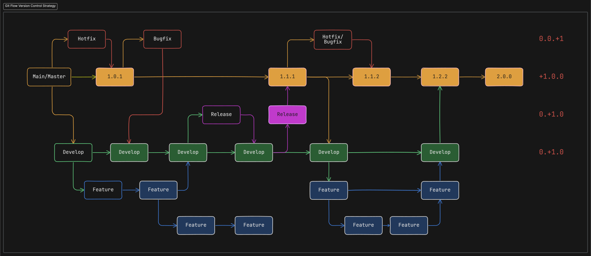

# Codigos de Git

En este repositorio se encuentran todos los codigos indispensables para trabajar con git y algunas teorias basicas del funcionamiento de estrategias de branches, teoria sobre funcionalidades de git etc.

---

## Tabla de contenido

- [Codigos de Git](#codigos-de-git)
  - [Tabla de contenido](#tabla-de-contenido)
  - [Teoria:](#teoria)
    - [Repositorio](#repositorio)
    - [Directorio](#directorio)
    - [Stache](#stache)
  - [Adicionales](#adicionales)
    - [Moverse entre carpetas](#moverse-entre-carpetas)
    - [Interacciones en consola](#interacciones-en-consola)
  - [Instalar Git](#instalar-git)
  - [Configuración](#configuración)
    - [Configuraciones iniciales](#configuraciones-iniciales)
    - [Configurar el editor de codigo](#configurar-el-editor-de-codigo)
  - [Codigos](#codigos)
    - [Inciar Git](#inciar-git)
    - [Deshacer commits](#deshacer-commits)
    - [Ramas de Git](#ramas-de-git)
    - [Git Merge](#git-merge)
    - [Merge conflic](#merge-conflic)
    - [ALIAS](#alias)
    - [Recuperación de commits](#recuperación-de-commits)
  - [GIT Y GITHUB](#git-y-github)
    - [Git Remote](#git-remote)
    - [Ejemplo Pagina Web:](#ejemplo-pagina-web)
    - [git stash, git stash apply git stash pop](#git-stash-git-stash-apply-git-stash-pop)
    - [estudiar git cherry-pick](#estudiar-git-cherry-pick)
    - [estudiar rebase y squash](#estudiar-rebase-y-squash)
    - [estudiar estrategias de branching](#estudiar-estrategias-de-branching)
      - [Git Flow](#git-flow)
        - [Introducción](#introducción)
        - [Descripción general de la estrategia de Git Flow](#descripción-general-de-la-estrategia-de-git-flow)
        - [Herramientas e integraciones de flujo de trabajo](#herramientas-e-integraciones-de-flujo-de-trabajo)
        - [Desafíos comunes](#desafíos-comunes)
        - [¿Comó utilizar GitFlow?](#comó-utilizar-gitflow)
  - [Conventional Commits](#conventional-commits)
    - [Resumen](#resumen)
    - [El commit contiene los siguientes elementos estructurales, para comunicar la intención a los consumidores de tu librería:](#el-commit-contiene-los-siguientes-elementos-estructurales-para-comunicar-la-intención-a-los-consumidores-de-tu-librería)
    - [Especificación](#especificación)
    - [estudiar submodulos](#estudiar-submodulos)
    - [¿Qué es Git bisect?](#qué-es-git-bisect)
    - [¿Qué es Git Hooks?](#qué-es-git-hooks)
      - [Pasos para activar un Hook](#pasos-para-activar-un-hook)
      - [Pasos para crear un Hook personalizado](#pasos-para-crear-un-hook-personalizado)
    - [estudiar gitflow, githubflow](#estudiar-gitflow-githubflow)
  - [Links, para más información de Git:](#links-para-más-información-de-git)

## Teoria:

### Repositorio

Un repositorio es un espacio(carpeta) donde guardamos todo lo que hacemos en el proyecto; el repositorio es donde esta todo, archivos junto con cambios

El repositorio es donde estan todos los archivos terminados

### Directorio

El area de trabajo es el directorio(carpeta), donde estan todos los archivos, donde trabajamos.

### Stache

El staching es donde estamos modificando, es un estado de preparación (staching area)

## Adicionales

### Moverse entre carpetas

`cd [para mover hacia adelante]`

`cd ../ [para mover hacia atras]`

`cd .. [para mover hacia atras]`

### Interacciones en consola

CREAR UNA CARPETA

`$mkdir nombre_de_carpeta`

ELIMINAR UNA CARPETA O ARCHIVOS

`$rmdir nombre_de_carpeta`

CAMBIAR EL NOMBRE DE UN ARCHIVO

`$ git mv archivo_a_renombrar archivo_renombrado`

Limpiar la consola con (clear o cls).

ABRIR VISUAL STUDIO CODE

`$code .`

## Instalar Git

Intalar git en la pagina oficial.

## Configuración

CUANDO CONFIGURAMOS LO QUE TENDREMOS EN GIT NECESITAMOS ENTENDER ESTO PARA DAR LOS DATOS PERSONALES.

-   Sistema: Todos los usuarios en la computadora y en los repositorios
-   Global: Solo un usuarios en la computadora
-   Local: Solo los repositorios

---

### Configuraciones iniciales

NOMBRE DE USUARIO

-   `$ git config --system user.name "Nombre"`
-   `$ git config --global user.name "Nombre"`
-   `$ git config --local user.name "Nombre"`

CORREO DE USUARIO

-   `$ git config --system user.email "xxxxxx@gmail.com"`
-   `$ git config --global user.email "xxxxxx@gmail.com"`
-   `$ git config --local user.email "xxxxxx@gmail.com"`

TODAS LAS CONFIGURACIONES QUE YA TENEMOS EN GIT DEFINIDAS

`$ git config --list`

COLOREAR LA INTERFACE

`$ git config --global color.ui true`

---

### Configurar el editor de codigo

`$ git config --global core.editor "code --wait"`

Lo que significa --wait, es para que cuando modifiquemos algo en visual studio code, se envie y confirme al cerrar visual studio code

ACTIVAR EL CRLF

`$ git config --global core.autocrlf true`

Lo que hace es que copia abajo y vuelve al inicio de la linea (como las maquinas de escribir).

## Codigos

### Inciar Git

1. Crear un directorio.
2. Entrar a la ruta del directorio por consola.
3. Inicializar Git
4. Comenzar en git

`$ git init`

PARA VER LOS ARCHIVOS EN LA CARPETA

`$ ls`

PARA SABER DONDE ESTAMOS PODEMOS VERLO EN LA CONSOLA, PERO TAMBIEN CON

`$ pwd`

PARA VER LOS ARCHIVOS OCULTOS

`$ ls -a`

PARA CARGAR LOS ARCHIVOS QUE DESEEMOS AL SER MODIFICADOS

`$ git add nombre_del_archivo`

Si en vez de nombre colocamos (.) se suben todos los archivos. Con add lo pasamos al area de preparación y no mas area de trabajo

VER INFORMACION SOBRE NUESTRA AREA DE TRABAJO Y SOBRE LOS ARCHIVOS DEL REPOSITORIO ETC

`$ git status`

PARA REMOVER LOS ARCHIVOS DEL AREA DE STAGE

`$ git rm --cached nombre_de_archivo`

HACER UN COMMIT ES ENVIAR DE STAGE A COMMIT

`$ git commit -m "mensaje que enviamos en el comentario"`

`$ git commit "con el comentario escrito desde el editor de codigo"`

`$ git commit -m "enviar directamente desde area de trabajo al commit" -a`

SI QUEREMOS RECUPERAR UN ARCHIVO BORRADO

`$ git restore nombre_de_archivo`

SI QUEREMOS DEVOLVER LOS CAMBIOS A COMO ESTÁN EN REMOTO

`$ git restore codigo_commit`

SI QUEREMOS DEVOLVER TODO A COMO ESTA EN EL STAGE Y NO LO SUBIMOS AL AREA DE STAGE (pierde los cambios)

`$ git checkout nombre_de_archivo`

MOSTRAR LOS CAMBIOS SIN MUCHA HABLADERA DE PAJA

`$ git status -s`

PARA VER EL HISTORIAL DE CAMBIOS DE UN ARCHIVO

`$ git show nombre_de_archivo`

Busca directamente el commit y pinta los cambios directamente del archivo.

PARA VER LA DIFERENCIA ENTRE NUESTRO ARCHIVO ACTUAL Y EL QUE ESTA EN COMMIT

`$ git diff --staged`

Muestra primero todo el archivo anterior y luego el actual.

PARA VER LOS COMMIT QUE HAY Y SUS DATOS

`$ git log`

`$ git log --oneline`

Muestra un resumen del identificador del commit sin datos de usuarios etc. Hay posibilidades que al resumir la forma en la que se identifica el commit se repita cuando hay miles de commits, para ello se debe cambiar el resumidor a 10 caracteres.

`$ git config --global core.abbrev "cantidad de caracteres"`

PARA VER LAS DIFERENCIAS PUNTUALES ENTRE LOS GOMMIT

`$ git diff "codigo de commit" "codigo de commit"`

PARA VER SOLO EL NOMBRE DE LOS ARCHIVOS CAMBIADOS

`$ git diff --name-only "codigo de commit" "codigo de commit"`

PARA VER LAS LINEAS DE LOS ARCHIVOS QUE CAMBIARON

`$ git diff --word-diff "codigo de commit" "codigo de commit"`

PARA MODIFICAR UN COMMIT

`$ git commit --amend`

Modificar el comentario dentro del commit

si lo que quremos es subir cosas nuevas al commit, tenemos que preparar todo como si fueramos a hacer un nuevo commit y luego hacemos lo mismo que en lo anterior.

El (HEAD-MASTER) lo que quiere decir es donde estamos posicionados con respecto a las ramas, en que commit estamos posicionados

Si lo que queremos es modificar un commit anterior, lo que sucedera es que se eliminaran todos los que esten despues de ese commit.

SI AUN ASI QUIRES MODIFICAR UN COMMIT ANTERIOR

`$ git rebase -i head~numero_de_indices_a_retroceder`

LUEGO PARA DEVOLVER LOS COMMIT QUE CARGAMOS

`$ git rebase --continue`

---

### Deshacer commits

FORMAS DE DESACER COMMITS

`$ git reset --soft codigo_de_commit o head~numeros_a_volver`

Forma de borrado suave, agarra los archivos del borrado y lo envia al area de staging.

`$ git reset --mixex codigo_de_commit o head~numeros_a_volver`

Forma de borrado media, lo que sucede es que eliminamos y no agrega ni elimina nada del area de staging.

`$ git reset --hard codigo_de_commit o head~numeros_a_volver`

Forma de borrado fuerte, elimina y sobreescribe todo, desde area de trabajo, staging y commit.

---

### Ramas de Git

-   Volver de una rama diferente a la master, se llama merge

PARA MOSTRAR LOS BRANCH

`$ git branch`

PARA CREAR UN NUEVO BRANCH

`$ git branch nombre-de-la-rama`

La forma de nombrar las ramas es quebap-case

MOVER ENTRE RAMAS

`$ git checkout rama-a-la-que-nos-moveremos`

`$ git swith rama-a-la-que-nos-moveremos`

Utilizar esta, es nueva pero esta optimizada.

FORMA DE CREAR Y MOVER A ELLA

`$ git checkout -b rama-nueva`

Creamos una rama con -b y nos movemos a ella inmediatamente.

`$ git switch -c rama-nueva`

Creamos una rama con -c y nos movemos a ella inmediatamente.

BORRAR LAS RAMAS

`$ git branch -d rama-que-queremos-borrar`

Tenemos que estar en otra rama para borrarla.

MODIFICAR RAMAS (si no estoy en la rama)

`$ git branch -m nombre-de-rama nombre-de-la-rama-modificada`

`$ git branch -m nuevo-nombre-de-rama-actual`

Si estoy en la rama.

FORZAR EL MOVER LAS RAMAS

`$ git branch -f name-branch codigo_commit (or HEAD~Index)`

Este codigo funciona, sin la necesidad de estar posicionado en la rama, que se desea mover.

`$ git checkout HEAD~Index`

Con este codigo podemos mover el head de la rama en la que estamos posicionados.

`$ git checkout HEAD^`

Podemos retroceder un espacio y con más `^^^` retrocedemos mas espacios.

---

### Git Merge

`$ git merge nombre-de-la-rama`

Tengo que estar en la rama que voy a la que voy a unir; las ramas seguiran existiendo, solo que se une a la otra.

---

### Merge conflic

Es ese conflicto que se da cuando al trabajar sobre otra rama, la rama mastes se modifica y luego nosotros queremos hacer un merge y no se sabe que modificacion hacer.

MOSTRAR LOS COMMITS DE TODAS LAS RAMAS

`$ git log --oneline --all`

SI NO PUSIMOS CONTINUAR AL RESOLVER EL CONFLICTO

`$ git merge --continue`

ACCEDER A LOS ARCHIVOS

`$ git lsr-tee -r --name-only codigo_de_commit`

Lo que hacemos con este es acceder a los archivos que posee un commit.

MOSTRAR TODOS LOS COMMITS Y ADEMAS GRAFICARLOS POR LAS RAMAS

`$ git log --oneline --all --graph`

---

### ALIAS

Los alias no llevan git

`$ git config --global alias.nombre-del-alias "todo el codigo que queremos resumir en alias"`

---

### Recuperación de commits

PARA RECUPERAR UN COMMIT BORRADO

-   Se necesita tener el codigo_commit

`$ git reset --hard codigo_commit`

RECUPERAR TODAS LAS REFERENCIAS DEL HEAD Y SUS MOVIMIENTO

`$ git reflog`

## GIT Y GITHUB

### Git Remote

GUARDAR EL ENLACE DEL REPOSITORIO REMOTO

`git remote add origin https://remote-repo-url`

CLONAR UN REPOSITORIO EN LA NUBE

En github se visualiza como fork, que es crear un clon del repositorio.

Origin hace referencia al repositorio en la nube

`$ git clone https://estedebeserelenlacecopiadodelrepositorio.com`

SUBIR EL REPOSITORIO A LA NUBE

`$ git push origin(donde) master(rama)`

El clon mantiene la referencia al repositorio remoto.

ACTUALIZAR EL CODIGO, TRAER EL CODIGO DEL REMOTO A MI REPOSITORIO LOCAL SE ACTUALIZA Y LE VALE MADRE LO QUE TENGAS, NO USAR SIN PENSAR

`$ git pull`

ACTUALIZAR EL CODIGO, TRAER EL CODIGO DEL REMOTO Y EVALUAR COMO LO VAS A UTILIZAR (GIT PULL HACE GIT FETCH Y LUEGO GIT MERGE)

`$ git fetch`

CREAR UN ARCHIVO

`$ touch archivo.txt`

SABER SI ESTOY CONECTADO A UN SERVIDOR REMOTO Y QUE PUEDO HACER

`$ git remote -v`

AGREGAR UN REPOSITORIO A LA NUBE

`$ git remote add origin(puede ser cualquier nombre) https://........`

CREAR UNA RAMA REMOTA DIRECTAMENTE DEL Local

`$ git branch -M main`

HACER UN PUSH A LA NUBE DIRECTAMENTE DEL LOCAL

`$ git push origin main`

si queremos configurar el push con todo eso por defecto agregar -u

`$ git push -u origin main`

---

-   Un fork es hacer una copia de un repositorio en mi repositorio de Github.

-   Un issue es una lista de tareas de un proyecto completo.

-   Una rama, un objetivo.

-   Rama debe ser descriptiva escrita con kevap-case.

-   No trabajar nunca en la rama principal, NUNCA.

-   Estrategias de branching.

-   Los commits deben de ser significativos; los commits deben de ser atomicos pero significativo, cambios importantes a nivel micro.

-   Los commits deben ser descriptivos.

-   Utilizar tags en el proyecto, debe ser importantes.

-   Mantener el historial limpios.

-   Commits innecesarios y no relacionables no se hacen
    piensa lo siguiente, que haces mucho en un proyecto, haces cambios importante y al finalizar todo el proyecto es que haces el commit, lo que sucede es que si una parte de ese proyecto la quieres mover y usarla en otros lugares tendras que moverla completa y eso no es lo que quieres directamente.

-   ahora si haces muchos pequeños commits innecesarios, para hacer algo simple tendras que trasladar muchos commits para poder hacer algo simple como aplicar una funcionalidad a otra rama entonces se debe hayar un equilibro ahi.

-   ejemplo: cambio importante y significativo pequeño.

### Ejemplo Pagina Web:

-   rama-master
    -   header-de-la-Web
        -   header-de-la-web-responsive
            -   boton-hamburguesa
            -   stage cambios-del-boton
                -   commit "creación del diseño del boton hamburguesa"
                -   commit "funcionalidad del boton hamburguesa"
                -   commit "Solución de problemas del boton hamburguesa inicial y cambios de colores en el diseño"

---

### git stash, git stash apply git stash pop

Si tenemos cambios que necesitamos guardar para cambiarnos a una rama que necesitamos trabajar lo solucionamos con stash (stash es un lugar temporal en el que guardamos los cambios pero estos no son directamente formalmente terminados) stash es un borrador

`$ git stash`

Guarda los cambios en una zona de borrador.

`$ git stash list`

Nos muestran los archivos guardados en el stash

`$ git stash show`

Nos muesta el archivo preciso en el que se modifico el codigo del stash.

`$ git stash show -p`

Nos muestra las lineas que fueron modificadas por este stash.

`$ git stash apply indice-del-cambio(si no agrego nada, devuelve todo)`

Devolvemos los cambios al area de trabajo.

`$ git stash push -m "comentario al stash"`

Agregamos un comentario al stash para identificarlo mejor.

`$ git stash pop indice-del-cambio(si no lo agrego borra el primero)`

Elimina el stash que seleccionamos.

`$ git stash drop indice-del-cambio`

Elimina el stash que seleccionamos.

---

### estudiar git cherry-pick

Un cherry pick es un proceso de traer los cambios de un commit a un merge, lo que sucede es que no hacemos un merge completo y el commit que hicimos se duplica ya que no elimina el de la rama secundaria, lo que sucede en ese caso es que tendremos dos commits identicos, si luego hacemos un merge completo de la rama.

`$ git cherry-pick codigo_de_commit ...`

Otra forma de crear un cherry-pick es con rebase, con esto logramos tener una ventana interactiva que nos permite elegir de multiples commits, cual queremos utilizar, y cuales no, reordenarlos etc, es mas simple si no queremos trabajar tan profundamente con los hashes.

`$ git rebase -i HEAD~Index (or codigo_commit)`

<!--
### estudiar milesthons

***

### estudiar tags

*** -->

### estudiar rebase y squash

Lo que hacemos con Git rebase, es tomar toda la rama x y colocarla por delante de la rama y, lo que pasa es que se sobre escribe el historial de las ramas y cambian los codigos de los commits, afectamos los historiales, si no se quiere modificar el historial lo mejor seria hacer un merge.

`$ git rebase nombre-de-la-rama`

Lo que hace Git squash es unir todos los commits en uno solo, pero no se hace el commit automatico sino que se queda en el stage area y para terminarlo, se debe hacer un commit nuevo, que contiene todos los commits anteriores.

`$ git merge --squash nombre-de-la-rama`

Debe acompañarse con un nuevo commit

### estudiar estrategias de branching

---

#### Git Flow

##### Introducción

Este documento proporciona una descripción general de la estrategia de control de versiones de Git Flow, diseñada para administrar el desarrollo de funciones de manera eficaz.

##### Descripción general de la estrategia de Git Flow

La estrategia de Git Flow es un modelo de ramificación que ayuda a optimizar el desarrollo de funciones y la administración de versiones. Los componentes clave de esta estrategia incluyen:

-   **Ramas de funciones**: se utilizan para desarrollar nuevas funciones.
-   **Ramas de versiones**: se utilizan para preparar una nueva versión de producción.
-   **Ramas de revisión**: se utilizan para parches rápidos para producción.
-   **Rama maestra**: contiene código listo para producción.
-   **Rama de desarrollo**: integra funciones para la próxima versión.

##### Herramientas e integraciones de flujo de trabajo

Para mejorar la estrategia de Git Flow, se utilizan las siguientes herramientas e integraciones:

-   **Herramientas de integración continua/implementación continua (CI/CD)**: automatizan las pruebas y la implementación.
-   **Plataformas de revisión de código**: facilitan las revisiones por pares y mantienen la calidad del código.
-   **Sistemas de seguimiento de problemas**: administran tareas y realizan un seguimiento del progreso.
-   **Herramientas de documentación**: garantiza una documentación completa y accesible.

##### Desafíos comunes

Los usuarios pueden encontrar los siguientes desafíos al implementar la estrategia de Git Flow:

-   Comprender la gestión de ramas
-   Resolver conflictos de fusión
-   Mantener las ramas actualizadas
-   Cumplir con las pautas de los mensajes de confirmación



##### ¿Comó utilizar GitFlow?

PARA INICIAR GITFLOW EN GIT

` $ git flow init`

Dar enter en todo lo que nos pregunta, por convención se recomienda no editarlo, si la estrategia que utilizamos es GitFlow, lo ideal es utilizar este codigo ya que con pocos comandos, nos permite hacer lo que hariamos con el doble de comandos.

La información que utilizare para explicar estos comandos los extrage del sitio web [Atlassian](https://www.atlassian.com/git/tutorials/comparing-workflows/gitflow-workflow) si quiere revisar de forma más detallada.

PARA CREAR CUALQUIER RAMA CON GITFLOW

`$ git flow feature start nombre-de-la-rama`

PARA CERRAR LA RAMA

`$ git flow feature finish nombre-de-la-rama`

En nosotros queda el utilizar correctamente la creacion y terminación de las ramas.

La rama se elimina automaticamente despues de realizar el merge de la misma con `develop`.

El flujo general de Gitflow es:

1. A `develop` la rama se crea a partir de `main`

2. A `release` la rama se crea a partir de `develop`

3. Feature las ramas se crean a partir de `develop`

4. Cuando a feature está completo se fusiona en el `develop` rama

5. Cuando el `release` la rama se hace en la que se fusiona `develop` y `main`

6. Si un problema en `main` se detecta a `hotfix` la rama se crea a partir de `main`

7. Una vez que el `hotfix` está completo, se fusiona con ambos `develop` y `main`

## Conventional Commits

### Resumen

La especificación de Commits Convencionales es una convención ligera sobre los mensajes de commits. Proporciona un conjunto sencillo de reglas para crear un historial de commits explícito; lo que hace más fácil escribir herramientas automatizadas encima del historial. Esta convención encaja con [SemVer](http://semver.org/lang/es/), al describir en los mensajes de los commits las funcionalidades, arreglos, y cambios de ruptura hechos.

El mensaje del commit debe ser estructurado de la siguiente manera:

> <tipo>[ámbito opcional]: <descripción>
>
> [cuerpo opcional]
>
> [nota(s) al pie opcional(es)]

### El commit contiene los siguientes elementos estructurales, para comunicar la intención a los consumidores de tu librería:

-   fix: un commit de tipo fix corrige un error en la base del código (se correlaciona con PATCH en el Versionado Semántico).

-   feat: un commit de tipo feat introduce una nueva funcionalidad en la base del código (se correlaciona con MINOR en el Versionado Semántico).

-   BREAKING CHANGE: un commit que contiene la nota al pie BREAKING CHANGE:, o que agrega un ! después del tipo/ámbito, introduce un cambio de ruptura de API (se correlaciona con MAJOR en el Versionado Semántico). Un BREAKING CHANGE puede ser parte de commits de cualquier tipo.

-   tipos distintos a fix: y feat: están permitidos, por ejemplo @commitlint/config-conventional (basados en la convención de Angular) que recomienda build:, chore:, ci:, docs:, style:, refactor:, perf:, test:, y otros.

-   notas al pie distintas de BREAKING CHANGE: <descripción> pueden ser añadidas y siguen una convención similar al formato Git trailer.

Tipos adicionales no son obligatorios en la especificación de Commits Convencionales, y no tienen un efecto implícito en el Versionado Semántico (al menos que incluyan un BREAKING CHANGE). Un ámbito puede ser añadido al tipo de un commit, para proveer información adicional contextual y debe ser contenido entre paréntesis, ej., feat(parser): add ability to parse arrays.

> #### Ejemplos
>
> -   Mensaje de commit con descripción y cambio de ruptura en la nota al pie
>
> -   feat: allow provided config object to extend other configs

BREAKING CHANGE: extends key in config file is now used for extending other config files

Mensaje de commit con ! para llamar la atención al cambio de ruptura

> refactor!: drop support for Node 6

Mensaje de commit con ambos ! y BREAKING CHANGE en la nota al pie

> refactor!: drop support for Node 6
>
> BREAKING CHANGE: refactor to use JavaScript features not available in Node 6.

Mensaje de commit sin cuerpo

> docs: correct spelling of CHANGELOG

Mensaje de commit con ámbito

> feat(lang): added polish language

Mensaje de commit con cuerpo multi-párrafo y múltiples notas al pie

> fix: correct minor typos in code
>
> see the issue for details
>
> on typos fixed.
>
> Reviewed-by: Z
>
> Refs #133

### Especificación

Las palabras clave “DEBE” (“MUST”), “NO DEBE” (“MUST NOT”), “REQUERIDO” (“REQUIRED”), “DEBERÁ” (“SHALL”), “NO DEBERÁ” (“SHALL NOT”), “DEBERÍA” (“SHOULD”), “NO DEBERÍA” (“SHOULD NOT”), “RECOMIENDA” (“RECOMMENDS”), “PUEDE” (“MAY”) y “OPCIONAL” (“OPTIONAL”) en este documento se deben interpretar como se describe en RFC 2119.

Los commits DEBEN iniciarse con un prefijo de tipo que consiste en un sustantivo, feat, fix, etc., seguido del ámbito OPCIONAL, !OPCIONAL, y dos puntos y un espacio REQUERIDO.

El tipo feat DEBE ser usado cuando un commit agrega una nueva funcionalidad a la aplicación o librería.

El tipo fix DEBE ser usado cuando el commit representa una corrección a un error en el código de la aplicación (bug).

Un ámbito PUEDE ser añadido después de un tipo. Un ámbito DEBE consistir en un sustantivo que describa una sección de la base del código encerrado entre paréntesis, ej., fix(parser):.

Una descripción DEBE ir inmediatamente después de los dos puntos y el espacio del prefijo de tipo/ámbito. La descripción es resúmen corto de los cambios realizados en el código, ej., fix: array parsing issue when multiple spaces were contained in string..

Un cuerpo de commit más extenso PUEDE agregarse después de la descripción corta, dando información contextual adicional acerca de los cambios en el código. El cuerpo DEBE iniciar después de una línea en blanco después de la descripción.

Un cuerpo de commit es de forma-libre y PUEDE consistir de cualquier número de párrafos separados por una nueva línea.

Una o más notas al pie PUEDEN ser añadidas una línea en blanco después del cuerpo. Cada nota al pie DEBE consistir de una palabra clave, seguida ya sea por un separador :<espacio> o <espacio>#, seguido por un valor cadena (string) (esto está inspirado por la convención Git trailer).

Una palabra clave de una nota al pie DEBE usar - en lugar de caracteres de espacios en blanco, ej., Acked-by (esto ayuda a diferenciar la sección de la nota al pie de un cuerpo multi párrafo). Se hace una excepción para BREAKING CHANGE, que también PUEDE ser usada como palabra clave.

Una nota al pie PUEDE contener espacios y líneas en blanco, y el parseo DEBE terminar cuando se observe el siguiente separador/clave.

Los cambios de ruptura DEBEN ser indicados en el prefijo de tipo/ámbito de un commit, o como una entrada en la nota al pie.

Si se incluye como una nota al pie, un cambio de ruptura DEBE consistir del texto en mayúsculas BREAKING CHANGE, seguido de dos puntos, y una descripción, ej., BREAKING CHANGE: environment variables now take precedence over config files.

Si se incluye en el prefijo de tipo/ámbito, cambios de ruptura DEBEN ser indicados por un ! inmediatamente después de :. Si ! es usado, BREAKING CHANGE: PUEDE ser omitido de la sección de la nota al pie, y la descripción del commit DEBERÁ ser usada para describir el cambio de ruptura.

Tipos diferentes a feat y fix PUEDEN ser usados en los mensajes de commit, ej., docs: updated ref docs..

Las unidades de información que componen Commits Convencionales NO DEBEN ser tratados como implementadores sensitivos de caso, con la excepción de BREAKING CHANGE que DEBE ir en mayúsculas.

BREAKING-CHANGE DEBE ser sinónimo de BREAKING CHANGE, cuando se usa en una nota al pie.

---

### estudiar submodulos

---

### ¿Qué es Git bisect?

**Git bisect** es una herramienta de depuración útil que se utiliza en Git para encontrar qué commit específico fue el primero en introducir un bug o problema en tu código.

**Funcionamiento**

Al tener una rama de Git con muchos commits y donde en uno de ellos se produce un error. Git bisect utiliza un algoritmo de búsqueda binaria para dividir eficientemente el historial de commits en dos partes:

1. **Inicio:** Identificas un commit "bueno" (sin el error) y un commit "malo" (con el error).
2. **Búsqueda binaria:** Git bisect selecciona un commit intermedio y te pregunta si ese commit es "bueno" o "malo".
3. **Iteración:** Basándose la respuesta, Git bisect descarta la mitad del historial donde no se encuentra el error y repite el proceso con un nuevo commit intermedio.
4. **Resultado:** Este proceso se repite hasta que se encuentra el commit exacto donde se introdujo el error.

**Ventajas de usar git bisect:**

-   **Eficiencia:** Al utilizar una búsqueda binaria, encuentra rápidamente el commit culpable, incluso en grandes historiales.
-   **Automatización:** Gran parte del proceso es automatizado, lo que ahorra tiempo y reduce la posibilidad de errores humanos.
-   **Precisión:** Identifica el commit exacto donde se introdujo el error, lo que facilita la depuración.

**¿Cuándo usar git bisect?**

-   Cuando tienes un bug difícil de reproducir y necesitas encontrar su origen.
-   Cuando quieres entender cómo evolucionó una determinada característica en tu código.
-   Cuando necesitas revertir un cambio que introdujo un error sin afectar otros cambios.

**Ejemplo básico:**

```bash
git bisect start
git bisect bad <hash del commit malo>
git bisect good <hash del commit bueno>
```

A partir de ahí, Git bisect te irá mostrando diferentes commits. Tú simplemente tienes que indicar si cada commit es "bueno" o "malo".

En la **documentación oficial de git** [git-scm.com/docs/git-bisect](https://git-scm.com/docs/git-bisect) puede encontrar más información.

Bisect significa (dividir en dos partes). Este es un metodo avanzado de depuración de codigo mediante Git con el que se pueden encontrar bugs y otros problemas en el codigo de forma rapida, puede resultar tedioso en un proyecto grande, a continuación solo se presentan unos comandos rapidos para utilizar git bisect

COMANDOS PARA UTILIZAR GIT BISECT

`$ git bisect start`

Esto iniciara la depuración, luego se debe identificar un rango, donde evaluaremos los problemas, para ellos debemos introducir.

1. Donde tenemos los problemas de software `$ git bisect bad codigo_commit_actual` puede ser otro commit, solo es donde detectamos el problema.
2. Donde sabemos que el codigo estaba bien `$ git bisect good codigo_commit_version_anterior` o donde sabemos que el codigo estaba bien.

Esto iniciara una depuración donde nos ira mostrando multiples commits y nosotros debemos determinar uno a uno si es bueno o malo e ir corrigiendo. Esto lo hacemos con `$ git bisect bad` o `$ git bisect good`.

Una vez se termina la depuración se utiliza el comando `$ git bisect reset`

Git bisect es mucho más complejo por ello se recomienda al momento de utilizar leer la documentación oficial.

---

### ¿Qué es Git Hooks?

#### Pasos para activar un Hook

#### Pasos para crear un Hook personalizado

---

### estudiar gitflow, githubflow

## Links, para más información de Git:

1. [Ejemplos interactivos y documentación](https://antonz.org/git-by-example/)
2. [Juegos para aprender Git](https://learngitbranching.js.org/?locale=es_ES)
3. [Atlassian](https://www.atlassian.com/git/tutorials/comparing-workflows/gitflow-workflow)
